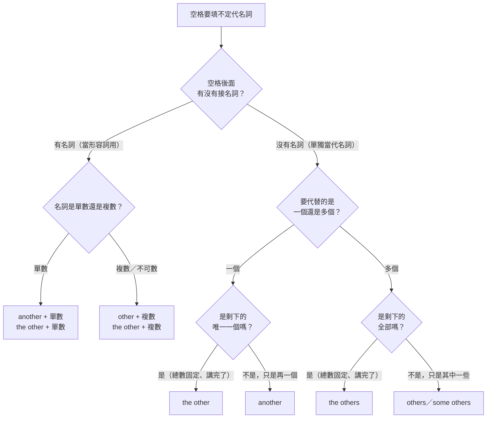

# 不定代名詞圖解 another、the other、others

> [!info] 這是 [[文法11 代名詞]] 考點 3 的深入圖解版。one、another、the other、others、the others 是多益 Part 5 每回幾乎必出的一題，錯的人多半不是不會背表格，而是沒看清楚「**總共有幾個、已經拿走幾個、剩下的算不算全部**」。

## 定義

不定代名詞就是**不指名道姓、只說「另一個／其他的」**的代名詞。選字時只看兩個問題：

1. **剩下的是一個，還是多個？** → 決定單數（another、the other）或複數（others、the others）。
2. **有沒有把剩下的全部講完？** → 講完了加 **the**（the other、the others），沒講完就不加（another、others）。

### 核心判斷表（背這張就夠）
|  | **單數**（剩下一個） | **複數**（剩下多個） |
|---|---|---|
| **不特定**（剩下的其中一部分，沒講完） | **another**<br>另一個（還有別的沒提到） | **others**<br>另外一些（還有別的沒提到） |
| **特定**（剩下的全部，講完了） | **the other**<br>剩下的那唯一一個 | **the others**<br>剩下的全部 |

> **the = 「就是剩下的那些，沒有別的了」**。這個 the 才是整章的關鍵，不是單複數。

## 為什麼重要

多益的選項通常就是 (A) another (B) other (C) others (D) the others 四個一起出現，四個字全部認得也可能選錯，因為題目考的是**上下文的數量關係**，不是單字意思。看懂圖就不用猜。

## 運作方式

### 情境 A｜總共只有兩個：one … the other
```
總共 2 個：   ⚫        ⚪
             one    the other
                    ↑ 剩下的唯一一個，非 the 不可
```
- One of our two branches is in Tokyo; **the other** is in Seoul.
- I have two proposals: one from Sales, **the other** from Marketing.

> 只有兩個時**不能**用 another。另一個必然是「特定的那一個」。

### 情境 B｜三個以上，一個一個點名：one … another … the other
```
總共 3 個：   ⚫        ⚫         ⚪
             one    another   the other
                    ↑ 中間隨便一個   ↑ 最後剩下的那一個
```
- We interviewed three candidates: one from Osaka, **another** from Kyoto, and **the other** from Nagoya.

> 中間可以連續好幾個 another（another…, another…），最後一個一定是 the other。

### 情境 C｜取走一個，其餘全部：one … the others
```
總共 5 個：   ⚫    |   ⚪ ⚪ ⚪ ⚪
             one   |     the others
                   ↑ 剩下的 4 個全部，一個不漏
```
- Only one machine is under repair; **the others** are running normally.

### 情境 D｜取走一些，其餘全部：some … the others
```
⚫ ⚫ ⚫  |  ⚪ ⚪ ⚪ ⚪
  some   |   the others
          ↑ 剩下的全部，總數固定且講完了
```
- Some of the files were archived; **the others** were deleted.

### 情境 E｜取走一些，另外一些（沒講完）：some … others
```
⚫ ⚫ ⚫    ⚪ ⚪ ⚪    ◌ ◌ ◌
  some      others    （還有沒提到的人，不追究）
                       ↑ 沒有 the，所以不必是全部
```
- Some employees prefer email; **others** prefer phone calls.
- Some customers requested refunds, while **others** asked for replacements.

> 這是多益最愛考的一組：**看到前面有 some、空格後沒有名詞 → 選 others**。

### 情境 F｜some others：另外還有一些
```
⚫ ⚫    ⚪ ⚪      ◌ ◌ ◌
some   some others  （仍然還有別的）
```
- Some attendees joined online, **some others** came in person, and still others canceled.
- 形容詞用法是 **some other + 複數名詞**：We should consider **some other options**.

> some others 只是 others 前面加上 some，語氣上更明確地切出「另外一群」。多益不常單獨考，但 **some other + 複數名詞**（不是 some another）是常見陷阱。

### 情境 G｜the other + 複數名詞：其餘的那些（= the others）
```
範圍已被前文框死（the seminar 的與會者）
⚫ 我（們）  |   ⚪ ⚪ ⚪ ⚪
             |   the other participants
             ↑ 剩下的全部，但後面留著名詞不省略
```
- Many scholars who attended the seminar strongly believe they can learn much from **the other participants**.（能從其餘的與會者身上學到很多）
- One request was approved; **the other** requests are still pending.

> **the other 當形容詞時，單數、複數都能接**（the other **plan**／the other **plans**）；只有單獨當代名詞時才鎖定單數。換句話說 **the others = the other + 複數名詞**，語意相同，差別只在後面有沒有把名詞留著。這一格是情境 C／D 的形容詞版。

### 選字流程圖


### 形容詞用法 vs 代名詞用法
| 字 | 可接名詞（形容詞） | 可單獨用（代名詞） | 等於 |
|---|---|---|---|
| another | ✅ another **plan**（單數） | ✅ I need **another**. | — |
| other | ✅ other **plans**（複數／不可數） | ❌ 不能單獨用 | — |
| the other | ✅ the other **plan**／**plans** | ✅ **The other** is ready. | — |
| others | ❌ 不能接名詞 | ✅ **Others** disagreed. | other + 複數名詞 |
| the others | ❌ 不能接名詞 | ✅ **The others** left. | the other + 複數名詞 |
| one another | ❌ 不能接名詞 | ✅ learn from **one another**（只能當受詞） | each other |

> 一句話記：**字尾有 s 的（others、the others）後面永遠不接名詞。**

### 動詞的單複數
| 主詞 | 動詞 | 例句 |
|---|---|---|
| another、the other | 單數 | **Another** **has** been approved. |
| others、the others | 複數 | **The others** **were** delayed. |

> 這只是 another 家族的規則。every／some／any／all／most／none 等其他不定代名詞的單複數規則更複雜，完整三大類分法見 [[文法11 代名詞]] 考點 5。

## 常見誤解

> [!warning] 高頻錯誤
> - ❌ another copies → ✅ another **copy**（another 後面只接單數）。
>   例外：**another + 數字 + 複數**，把數量看成一個單位：another **two weeks**、another **10 items**。
> - ❌ others employees → ✅ **other** employees（others 不接名詞）。
> - ❌ some another options → ✅ some **other** options。
> - 只有兩個東西時，❌ one … another → ✅ one … **the other**。
> - **others vs the others**：沒有 the 就代表「還有別人沒被提到」；有 the 代表「剩下的就這些」。題目若出現 all、both、the rest 這種把總數框死的字，通常要選 the others。
> - **each other（兩者互相）vs one another（三者以上互相）**：現代英文與多益兩者通用，不必細分。
> - the other 也可以接複數名詞（**the other** employees = 其餘的員工），別以為 the other 只能配單數。詳見情境 G。
> - ❌ learn much from **one another participants** → ✅ learn much from **the other participants**（保留名詞），或 learn much from **one another**（刪掉名詞）。one another／each other 是**相互代名詞**，只能當受詞，永遠不能修飾後面的名詞。

> [!tip] 多益出題方向
> 1. 空格後有**單數名詞** → another；有**複數名詞** → other。
> 2. 空格後**沒有名詞**、前面出現 **some** → others（每回約 1 題，最常考）。
> 3. 句中出現 **two**、**both**、只有兩個選項 → the other。
> 4. 句中把總數講死（of the ten…、all of them）、要指「其餘全部」 → the others。
> 5. Part 6 會考跨句指涉：前一句提到 some…，後一句空格就填 others。
> 6. 空格後有**複數名詞**、且前文已把範圍框死（the seminar、our team、of the ten…）→ **the other + 複數名詞**；此時 others 與 one another 因為不能接名詞而直接出局，another 又只配單數，四選一瞬間只剩一個。

## 實戰練習

1. The company operates two warehouses; one is in Chicago and ______ is in Dallas.
   (A) another (B) other (C) the other (D) others
2. Some of the attendees registered online, while ______ signed up at the door.
   (A) another (B) others (C) the other (D) other
3. We will need ______ three days to complete the inspection.
   (A) another (B) others (C) the others (D) other
4. Of the twelve applications received, four were approved and ______ were rejected.
   (A) other (B) another (C) the others (D) others
5. If this model is unavailable, please recommend ______ suitable products.
   (A) another (B) others (C) the others (D) some other
6. Many scholars who attended the seminar strongly believe they can learn much from ______ participants.
   (A) another (B) others (C) the other (D) one another

**解答與解析**
1. (C)　總共只有兩個，第二個必然是特定的那一個 → the other。情境 A。
2. (B)　前面有 some 呼應、空格後沒有名詞、也沒把總數講死 → others。情境 E。
3. (A)　another + 數字 + 複數名詞（three days 視為一個單位）→ another。常見誤解節的例外。
4. (C)　總數 twelve 已框死、四件核准，其餘全部被拒 → the others。情境 D。
5. (D)　空格後有複數名詞 products，others／the others 不能接名詞，another 只接單數 → some other。情境 F。
6. (C)　空格後是複數名詞 participants：another 只接單數，others 與 one another 都不能修飾名詞；範圍已被 the seminar 框死 → the other participants（= the others）。情境 G。
   - 若把 participants 刪掉，(B)(D) 就都成立：learn much from **others**（其他人）／learn much from **one another**（彼此互相）。

## 相關概念
- [[文法11 代名詞]]（本頁的母章節，考點 3）
- [[TOEIC 文法 Cheatsheet]]
- [[文法12 形容詞]]（數量形容詞 each／every／another + 單數）
- [[文法04 動詞與主詞的單複數一致]]
- [[我的錯題本]]
